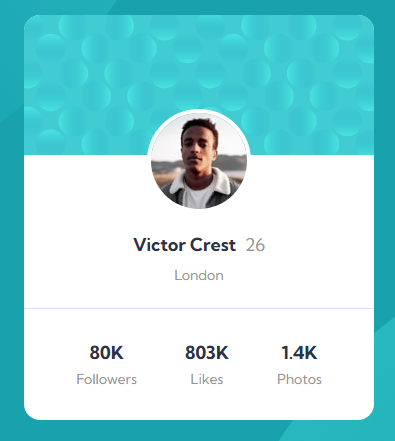

# Profile Card Component

Este projeto é uma solução para o desafio [Profile Card Component](https://www.frontendmentor.io/challenges/profile-card-component-cfArpWshJ) do **Frontend Mentor**. O objetivo foi criar um componente de cartão de perfil responsivo, utilizando HTML e CSS.

## 🚀 Visão Geral

O projeto consiste em um cartão de perfil que exibe informações como nome, idade, localização e estatísticas (seguidores, curtidas e fotos). O layout é responsivo, adaptando-se a diferentes tamanhos de tela.

### 🖥️ Demonstração

Confira o projeto em funcionamento: [Link para o projeto](https://cadanieldev.github.io/profile-card-component/)

### 📸 Screenshots

**Desktop:**

**Mobile:**

## 🛠️ Tecnologias Utilizadas

- **HTML5**: Estrutura semântica do componente.
- **CSS3**: Estilização e responsividade.
- **Flexbox**: Para alinhar os elementos internos.
- **Google Fonts**: Utilização da fonte Kumbh Sans.
- **Variáveis CSS**: Para facilitar a manutenção das cores.

## 📂 Estrutura do Projeto
